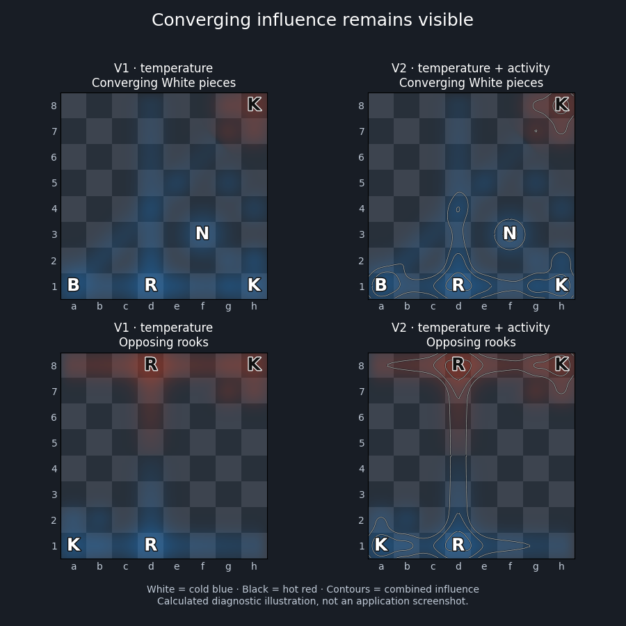

# Heatmap v2: overlapping influence

V2 retains the continuous cold White / hot Black temperature field and preserves each side's influence separately. Temperature is Black minus White; activity is Black plus White. Multiple pieces therefore accumulate influence, and opposing influence no longer disappears from every visual channel when temperature cancels.

Enable the heatmap from the board controls. The new **Activity contours** switch defaults on and can be turned off to compare with v1. Pale contour lines mark fixed combined-influence levels (1.25, 2.5, 5, 10 and 20 at the default scale of 20). Levels follow the configured scale, not the current position's maximum. Existing saved settings migrate automatically.

This illustration uses the actual field calculation and extracted contours; it is not an application screenshot. Piece letters identify locations. Try these diagnostic positions:

- Converging White bishop, rook and knight at d4: `7k/8/8/8/8/5N2/8/B2R3K w - - 0 1`
- Opposing rooks along the d-file: `3r3k/8/8/8/8/8/8/K2R4 w - - 0 1`

The first shows a local concentration where several pieces converge. The second retains an activity corridor through the otherwise neutral middle of the file. Colour expresses the balance; contours expose activity even where that balance is neutral.

## Meaning and limits

Activity includes weighted occupied-square sources and directional attack influence. It is not an attacker count, legal-move count, tactical evaluation or guarantee that a capture is safe. Geometry, blockers, distance falloff and configured piece weights still determine contributions. Pinned pieces still contribute geometric influence. Fluid dynamics and engine-derived tactical analysis remain future experiments.

The backend contract accepts optional paired White/Black channels, leaving temperature-only backends usable. Missing channels disable activity rather than inventing it from net temperature. Transitions interpolate both channels alongside temperature. Rendering shares board orientation, opacity and pixel-density transforms.

## Validation

- Full frontend suite: 76 tests in 13 files passed.
- TypeScript and Vite production build passed.
- Scoped heatmap lint: zero errors or warnings.
- Independent review found no blocking issues; 18 affected tests were also independently rerun.
- A 100-iteration Node 24 benchmark at 128 × 128 on the starting position measured field calculation plus contour extraction: median 12.0 ms, p95 14.0 ms. This excludes browser painting and is not a frame-rate measurement.
- Native desktop execution and actual application visual testing were not available in this environment. The calculated comparison image was visually inspected.

Future profiling should examine per-cell contour allocations if frame-time pressure appears. A dedicated saddle-cell topology regression test is also deferred. The current contour method intentionally splits each grid cell into triangles.
